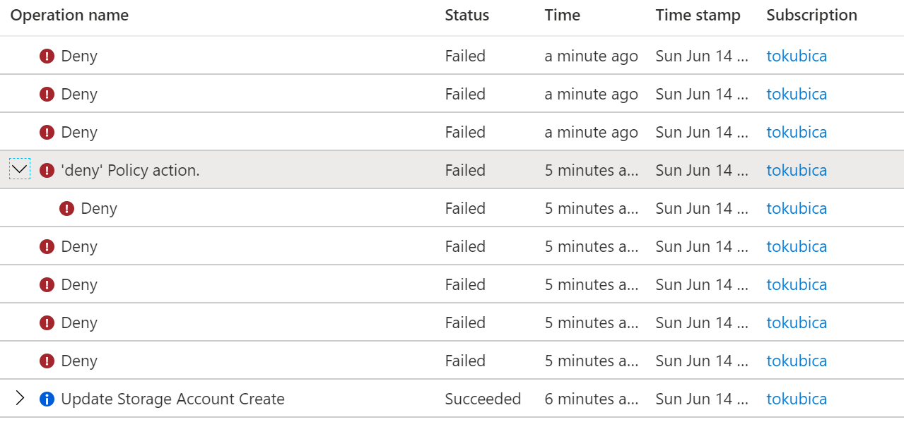

# Resource move policy issue
This section investigates options to enforce policies in situation of resource move between unmanaged and managed subscriptions.

## Problem statement
Consider managed subscription with Azure Policies in place defined by central team to enforce limitations on VNETs, usage of public IPs, enforced auditing and encryption settings. Also consider there are unmanaged subscriptions in the same tenant with no policies.

User can be contributor in both unmanaged and managed subscription and initiate movement of resources between subscriptions. During this proces Azure Policies in destination subscription are not checked/enforced creating security risks. One example is data exfiltration - managed subscription might be locked from accessing Internet without going throw NGFW/DLP platform. User can move VM with public Internet access (unmanaged VNET) to managed subscription, take disk from managed corporate VM, attach it to this unmanaged resource and copy data from disk to some endpoint in Internet.

## Test environment
```bash
# Create two resource groups
az group create -n test-source -l westeurope
az group create -n test-destination -l westeurope

# Create policy and assing to just one resource group
az policy definition create -n moveTest \
    --display-name "moveTest" \
    --mode all \
    --rules tagging.rules.json

az policy assignment create -n moveTest-rg-policy \
    --display-name "moveTest" \
    --policy moveTest \
    --resource-group test-destination \
    --sku standard

# Deploy non-compliant resource in RG with policy - FAIL
az storage account create -n notagtest123 -g test-destination --tags badthing=true

# Deploy non-compliant resource in RG withhout policy - PASS
az storage account create -n notagtest123 -g test-source --tags badthing=true

# Move non-compliant resource to RG with policy - PASS (not desired outcome, violates policy)
az resource move --destination-group test-destination --ids $(az storage account show -n notagtest123 -g test-source --query id -o tsv)

# Clean up
az group delete -n test-source -y --no-wait
az group delete -n test-destination -y --no-wait
az policy assignment delete -n moveTest-rg-policy --resource-group test-destination
az policy definition delete -n moveTest
```

Activity Log shows Deny on even initiate by Microsoft Azure Policy Insights, but only after resource has been moved.


## Potential solutions and workarounds

Custom RBAC - proactive, but not complete, [details here](#custom-rbac) 
- Can prevent movement of unwanted resources by removing permisisons to write such objects (eg. VNET, Public IP)
- Does not prevent writing resources that must be allowed, but some properties enforced (eg. enforced TLS on storage account, tag structure, audit logs enabled)
- Require change on existing subscriptions by moving from Contributor role to custom role

More ideas:
- test audit policy to be able to report on violations rather then deny
- modify resource for policy to kick in
- rewrite key policies to simple code and:
  - listen on change feed and generate alert using Functions or/and Logic Apps
  - use scheduled jobs (Funcitons, Logic App or Automation script)
- can change feed or activity log recognize move operation?

### Custom RBAC
TBD